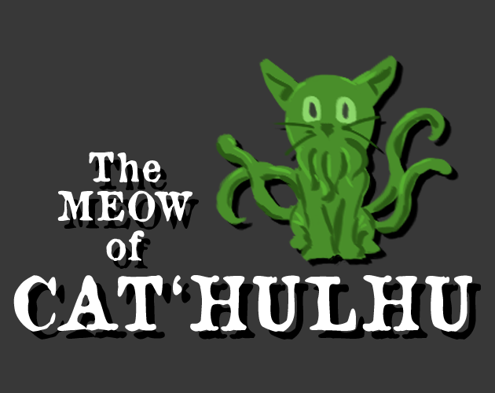
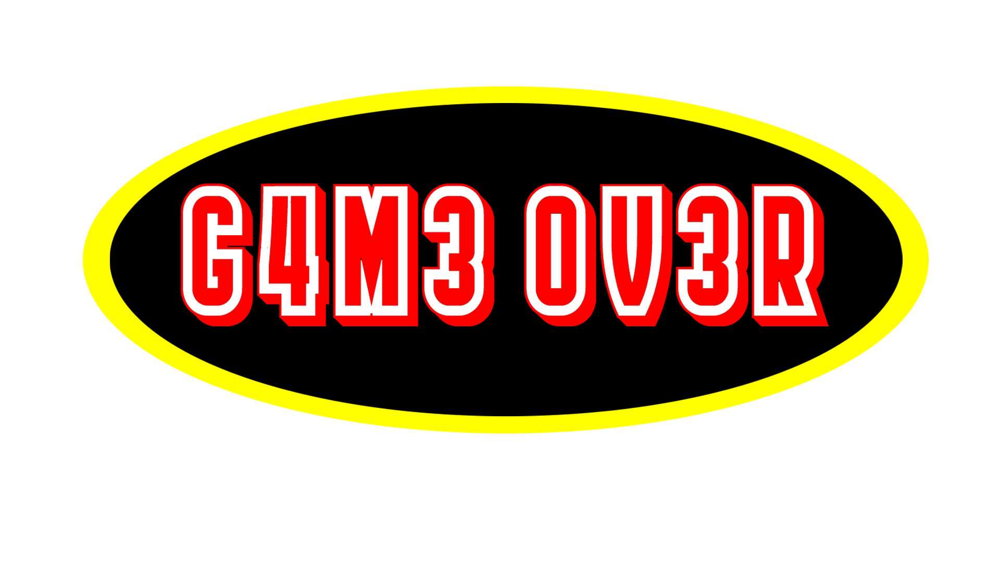
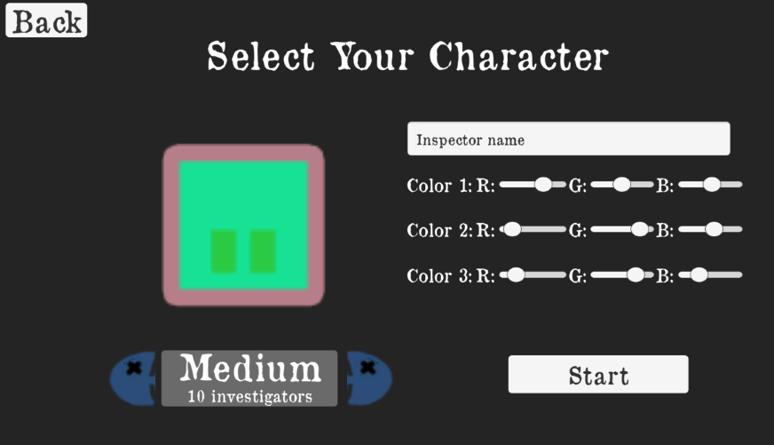
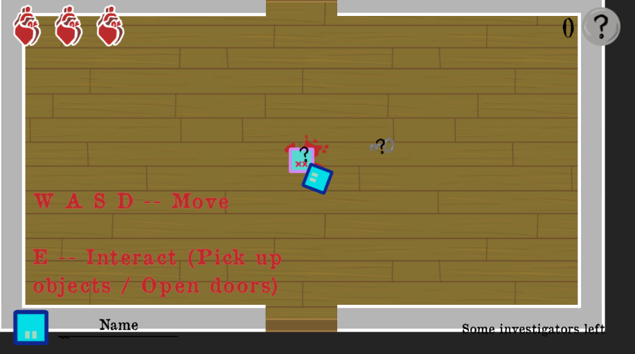
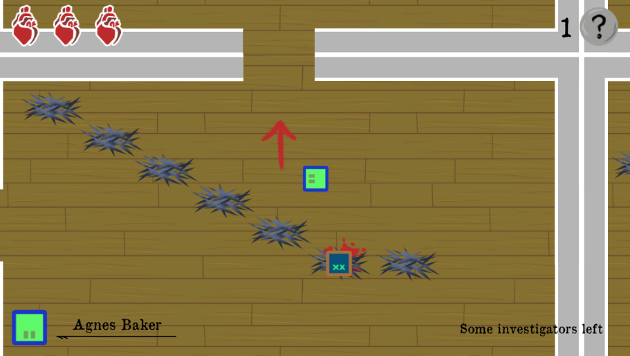

# The Meow of Cat'hulhu

Game for the GameDev.tv 2022 Game Jam.

GameJam Theme: Death is only the beginning

## Team

- Pep Mañas: @Neengash (Instagram, Github, itch.io)
- Jaume Riera: @xubecgames(itch.io, instagram)

|**Design** | **Development** | **Art** |
| --- | --- | --- |
| Pep Mañas | Pep Mañas | Pep Mañas |
| Jaume Riera | Jaume Riera | |

## Description

You are an investigator called to solve a mistery about a death occurred at the University of Wiskatonic. This death, is just the beginning...

## Assets used

### Music

* [Background: "Past Sadness" Kevin MacLeod (incompetech.com) (Licensed under Creative Commons: By Attribution 4.0 License)](https://incompetech.com/music/royalty-free/music.html)
* [Player death: "01675 fight growl.wav" Robinhood76 (freesound.org)(Licensed under Creative Commons: By Attribution 4.0 License)](https://freesound.org/people/Robinhood76/sounds/100673/)
* [Door opening: "Door, Front, Opening, A.wav" InspectorJ (freesound.org)(Licensed under Creative Commons: By Attribution 4.0 License)](https://freesound.org/people/InspectorJ/sounds/431117/)
* [Enemy hit: "Gushing Flesh" magnuswaker (freesound.org) (Licensed under Creative Commons: 0 License)](https://freesound.org/people/magnuswaker/sounds/563315/)
* [Player hit: "Moaning" Nicolas4677 (freesound.org) (Licensed under Creative Commons: 0 License)](https://freesound.org/people/Nicolas4677/sounds/446588/)
* [Door locked: "Door Locked" BenjaminNelan (freesound.org) (Licensed under Creative Commons: 0 License)](https://freesound.org/people/BenjaminNelan/sounds/321087/)
* [Key: "glic.aif" joseph.larralde (freesound.org) (Licensed under Creative Commons: 0 License)](https://freesound.org/people/joseph.larralde/sounds/352494/)
* [Clue: "Small Bell #2" steffcaffrey (freesound.org) (Licensed under Creative Commons: 0 License)](https://freesound.org/people/steffcaffrey/sounds/452379/)

### Font

* ["Old Newspaper types" Manfred Klein (dafont.com) (Licensed under Creative Commons: 0 License)](https://www.dafont.com/es/oldnewspapertypes.font)

### Libraries

* [A* Pathfinding arongranberg](https://arongranberg.com/astar/)

## Gameplay Images

